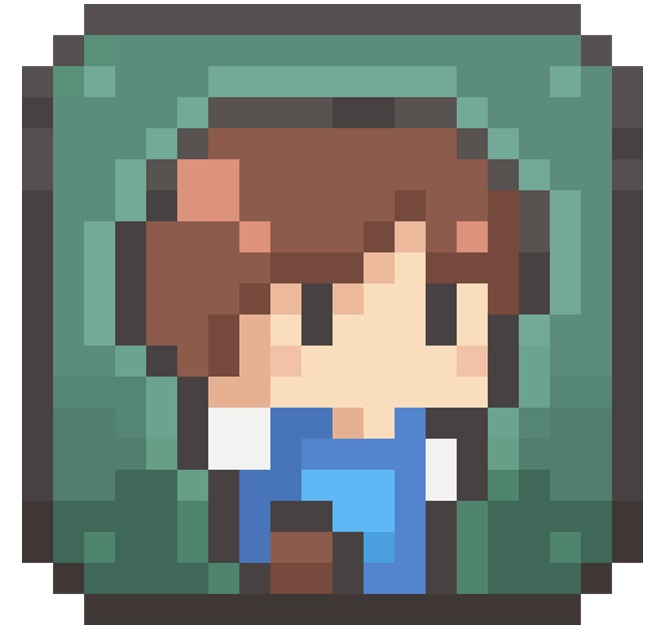
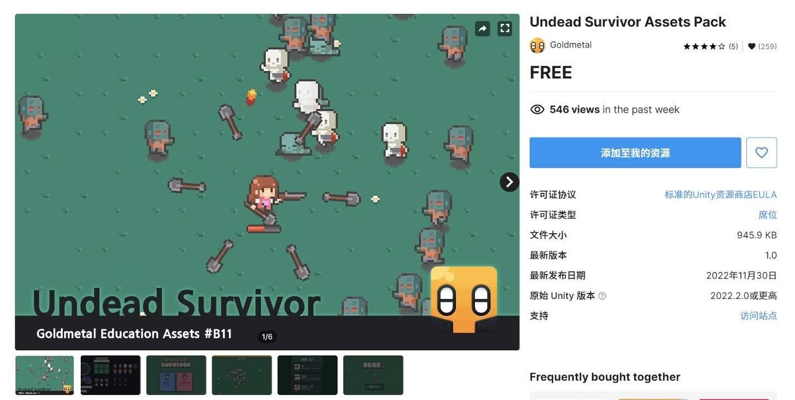
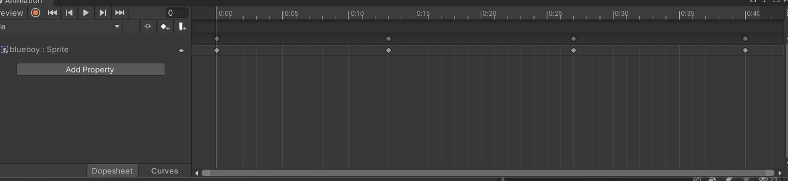
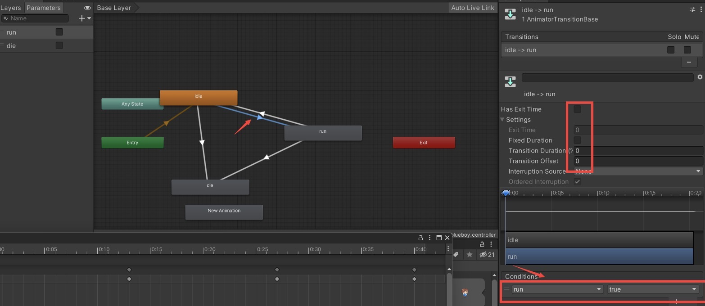
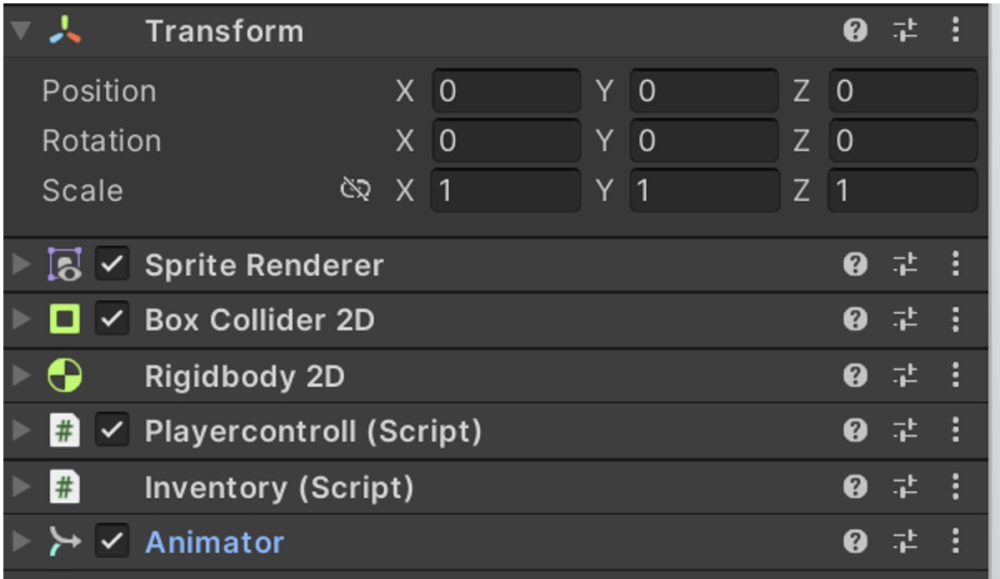
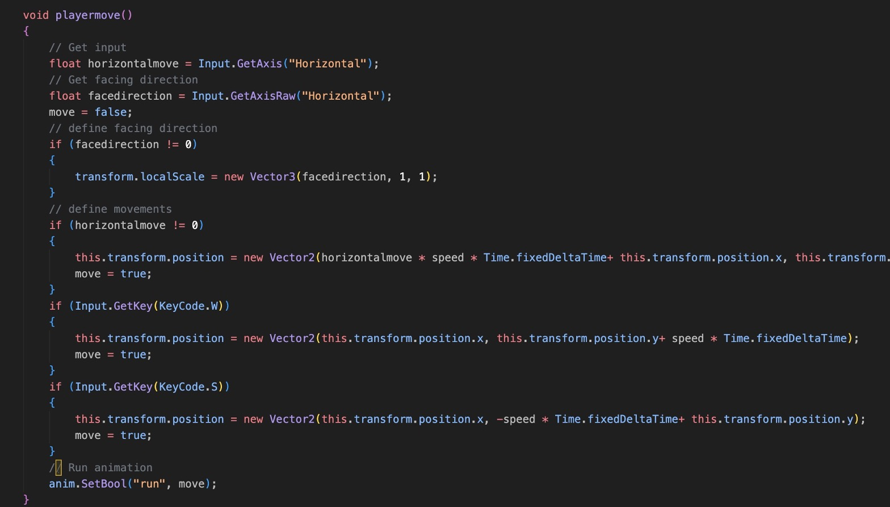

## Game Design tutorial

This tutorial aims to demonstrate how to realize character movements in Unity Engine, whichh is one of most basic functions in any games. In this project, a character from Unity Asset Store is used as an example, and the entire project file can be download from [Google drive][https://drive.google.com/file/d/1YLikoaRcjS-FViOHQH-A6wQJaJki-yGG/view?usp=drive_link].

### Procedure

The procedure can be divided into three parts

- Animations: Create character related animations based on original resource

- Arnimator: Build Prefab of thhe character, which includes animations 

- Control Scripts: Programming scripts to control the character

  

Details follow the description below:

**Animations **

Download resource from asset store:

1. Get partial original game material in the Unity Asset Store；

2. Cut frames from original sprite images

3. Build animations

   

**Animator**

1. Build an `animator` , which links the transaction between animations

   

   

   

2. Set boundary conditions (contains variables)

**Control Scripts **

Load  `run` variable  from `animator`  and idle from `Sprite Renderer`

1. Link the Character object with a control script

   

   

   

2. horizontal moments: Using default `GetAxis` function in Unity engine

3. horizontal moments:  `Input.GetKey(KeyCode.W)`  function and set position transform 

   

Please view the Game tutorial for details